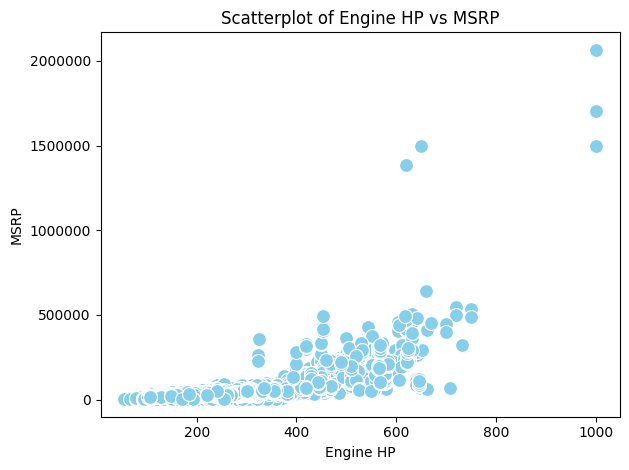
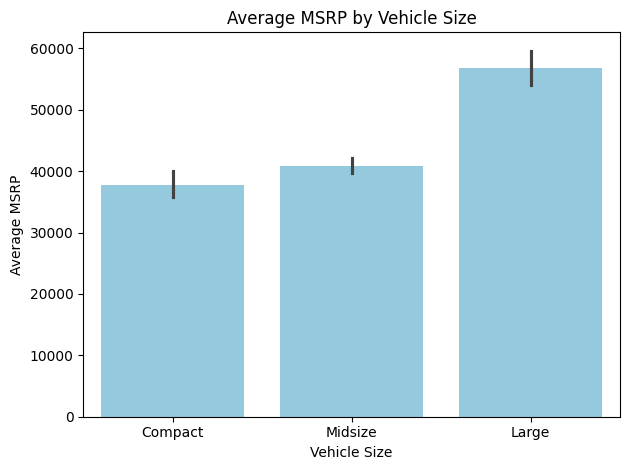
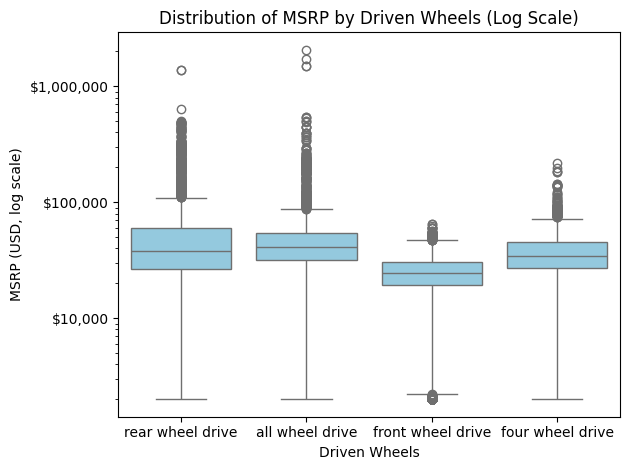

# Car Market Analysis: Pricing, Performance & Fuel Efficiency (1995–Present)

## Overview
This project analyzes a comprehensive car dataset to explore relationships between vehicle pricing, performance, and fuel efficiency.  
The analysis focuses on vehicles manufactured from 1995 onwards and applies data cleaning, feature engineering, exploratory data analysis (EDA), and visualization techniques using Python.

---

## Project Objectives
- Clean and preprocess the dataset, including handling missing values and filtering by model year
- Engineer meaningful features such as Total MPG and Price per HP
- Explore how vehicle characteristics influence price and fuel efficiency
- Identify patterns across vehicle size, drivetrain, and engine performance

---

## Dataset
- Source: Public car dataset (CSV format)
- Size: ~11,000 vehicles
- Time span: 1995–present
- Key features include:
  - Engine specifications (HP, cylinders, fuel type)
  - Drivetrain and transmission
  - Fuel efficiency (city & highway MPG)
  - Popularity and MSRP

---

## Short EDA Methodology
- Removed or imputed missing values based on their proportion and analytical relevance
- Filtered the dataset to include vehicles from model year 1995 and later
- Standardized categorical text fields for consistency
- Created derived features to better capture efficiency and pricing dynamics
- Used descriptive statistics, grouping, correlation analysis, and visualizations to identify patterns

---

## Key Insights
- Engine horsepower shows a strong positive correlation with MSRP (r ≈ 0.65)
- Larger vehicle sizes are associated with higher average prices
- AWD and RWD vehicles are significantly more expensive than FWD vehicles
- Higher engine power is associated with lower fuel efficiency
- City MPG and highway MPG are strongly correlated (r ≈ 0.84)

---

## Key Visualizations

### Engine Horsepower vs MSRP
*Relationship between vehicle performance and price*



---

### Average MSRP by Vehicle Size
*Pricing differences across market segments*



---

### MSRP Distribution by Driven Wheels
*Price differences across drivetrain configurations*



*Note: A logarithmic scale is used to handle extreme price outliers, while axis labels are formatted in USD for better interpretability.*

---

## Project Structure

- README.md
- [requirements.txt](requirements.txt)

- **data/**
  - [car_data.csv](car_data.csv)

- **notebooks/**
  - [car_analysis.ipynb](car_analysis.ipynb)

- **visuals/**
  - [hp_vs_msrp.png](hp_vs_msrp.png)
  - [msrp_by_vehicle_size.png](msrp_by_vehicle_size.png)
  - [msrp_by_drivetrain.png](msrp_by_drivetrain.png)

---

## Technologies Used
- Python
- pandas
- seaborn
- matplotlib
- Jupyter Notebook / Google Colab

---

## How to Run
1. Clone this repository
2. Install dependencies:
   ```bash
   pip install -r requirements.txt
Open notebooks/car_analysis.ipynb

Run all cells to reproduce the analysis
